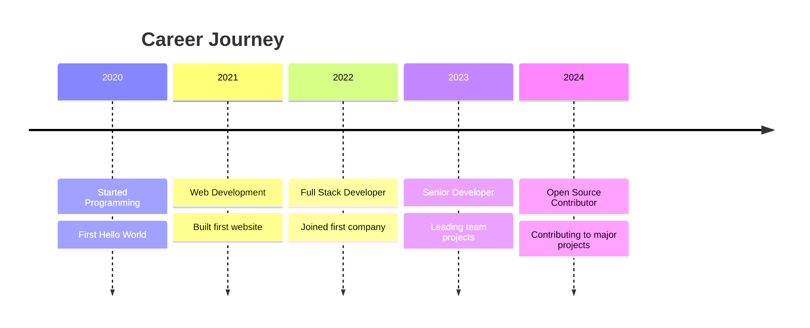

# Hi there! 👋 I'm [Your Name]

<div align="center">
  
</div>

## 🚀 About Me

- 🔭 I'm currently working on **exciting projects**
- 🌱 I'm currently learning **new technologies**
- 👯 I'm looking to collaborate on **open source projects**
- 💬 Ask me about **anything tech related**
- 📫 How to reach me: **your.email@example.com**
- ⚡ Fun fact: **I love coding and coffee!**

## 🛠️ Tech Stack

### Languages


### Frameworks & Libraries


### Databases & Cloud


## 📊 GitHub Stats

<div align="center">
  
</div>

<div align="center">
  
</div>

<div align="center">
  
</div>

## 🏆 GitHub Trophies
<div align="center">
  
</div>

## 📈 Activity Graph
<div align="center">
  
</div>

## 🎯 Current Focus

```javascript
const currentFocus = {
    learning: ["Machine Learning", "Web3", "Cloud Architecture"],
    building: ["Personal Portfolio", "Open Source Tools"],
    reading: ["Clean Code", "System Design Interview"],
    goals: ["Contribute to major OSS", "Build SaaS product", "Tech leadership"]
};
```

## 🌟 Featured Projects

<div align="center">
  <a href="https://github.com/YOUR_USERNAME/project1">
    
  </a>
  <a href="https://github.com/YOUR_USERNAME/project2">
    
  </a>
</div>

## 💼 Experience Timeline



## 🎨 Contribution Graph

<div align="center">
  
</div>

## 🤝 Connect With Me

<div align="center">
  
[](https://linkedin.com/in/your-profile)
[](https://twitter.com/your-handle)
[](https://your-portfolio.com)
[](mailto:your.email@example.com)

</div>

## 💡 Random Dev Quote

<div align="center">
  
</div>

## 🎵 Currently Vibing To

<div align="center">
  
[](https://open.spotify.com/user/YOUR_SPOTIFY_USERNAME)
  
</div>

## ⚡ Fun Facts

- 🎮 I love gaming in my spare time
- 📚 I read 20+ books per year
- ☕ I drink 5+ cups of coffee daily
- 🌍 I've contributed to 50+ open source projects
- 🚀 I'm always excited about new technologies

---

<div align="center">
  
</div>

<div align="center">
  <h3>⭐️ From [Your Name](https://github.com/YOUR_USERNAME)</h3>
</div>
