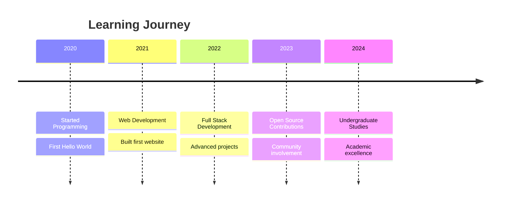

# Hi there! 👋 I'm Januda Liyanage

  

## 🚀 About Me

- 🎓 I'm currently an **undergraduate student**
- 🌱 I'm currently learning **new technologies**
- 📫 How to reach me: **januda204@gmail.com**
- ⚡ Fun fact: **I love coding and coffee!**

## 🛠️ Tech Stack

### Languages

### Frameworks & Libraries

### Databases & Cloud

## 📊 GitHub Stats

  

  

  

## 📈 Activity Graph

  

## 🎯 Current Focus

**🎓 Academic Journey**
- Machine Learning & AI
- Web Development
- Data Structures & Algorithms
- Software Engineering Principles

**🚀 Personal Projects**
- Building Portfolio Website
- Contributing to Open Source
- Learning Cloud Technologies

## 🌟 Featured Projects

  
  

## 💼 Experience Timeline

## 🎨 Contribution Graph

  

## 🤝 Connect With Me

  

## 💡 Random Dev Quote

  

## 🎵 Current Vibe

  

  
**🎧 Check out my coding playlist!**
  

## ⚡ Fun Facts

- 🎮 I love gaming in my spare time
- 📚 I read tech books regularly
- ☕ I drink multiple cups of coffee daily
- 🌍 I'm passionate about open source
- 🚀 I'm always excited about new technologies

---

  

  <h3>⭐️ From Januda Liyanage</h3>

